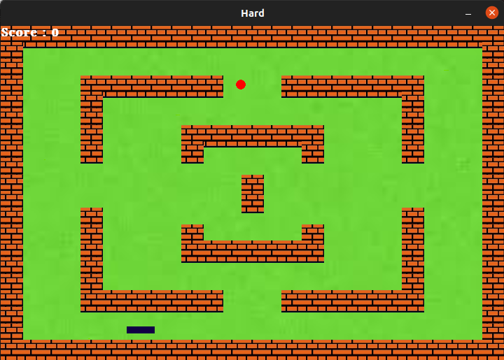

# [**Snake Game**](https://ru.wikipedia.org/wiki/Snake_(%D0%B8%D0%B3%D1%80%D0%B0))

  

**Description Of the Game**
=====
*In [**wikipedia**](https://ru.wikipedia.org/wiki/Snake_ (%D0%B8%D0%B3%D1%80%D0%B0)) you can find the history and description of the game. 
The snake written by me is a modification of that game. There are two levels instead of one level. The game is divided into two levels: **Easy and Hard**. When you enter the game, a menu will open to select one of the levels.  
In addition to apples, the snake can eat some other fruit and, depending on what kind of fruit it ate, it gets points. (in my modification there are two kind of fruit: **apple and pineapple**). Apple give 5 points and pineapple gives 10 points.
The game will end if the snake bites its body or collides with fences.*

**Patterns**
====
1. **Abstract Factory** - this pattern was used to create fruits.
2. **Button** - this factory is partly used for buttons on main menu.

**Screenshots**
===

### Main Menu

  

### Easy Level Map

  

### Game Over in Easy Level

  

### Hard Level Map

  

### Game Over in Hard Level

  

**RUN**
=====

### First download the necessary libraries
    pip install -r requirements.txt

### Run
    python3 main.py
